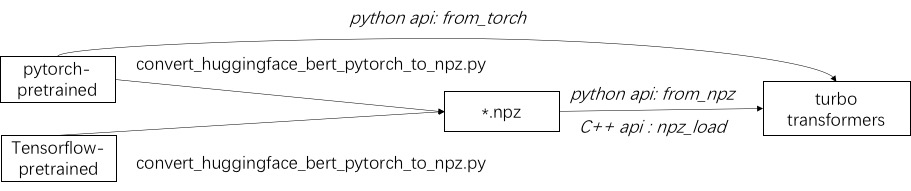

## TurboTransformers: a fast and user-friendly runtime for transformer inference on CPU and GPU


<center>Make transformers serving fast by adding a turbo to your inference engine!</center>

The WeChat AI open-sourced TurboTransformers with the following characteristics.

1. Supporting both Transformers Encoder and Decoder.
3. Supports Variable Length inputs. No time-consuming offline tuning is required. You can change batch size and sequence length at real-time.
3. Excellent CPU / GPU performance.
4. Perfect Usibility. TurboTransformers supports python and C++ APIs.
5. Smart Batching. Minimize zero-padding overhead for a batch of requests of different lengths.
It can be used as a plugin for pytorch. Tthe end-to-end acceleration is obtained by adding a few lines of python code.


TurboTransformers has been applied to multiple online BERT service scenarios in Tencent.
For example, It brings 1.88x acceleration to the WeChat FAQ service, 2.11x acceleration to the public cloud sentiment analysis service, and 13.6x acceleration to the QQ recommendation system.
Moreover, it has already been applied to build services such as Chitchating, Searching, and Recommendation.

The following table is a comparison of TurboTransformers and related work.

| Related Works  |  Performance | Need Preprocess  |  Variable Length  | Usage |
|------------------|---|---|---|---|
| pytorch JIT (CPU) |  Fast |  Yes  | No  | Hard   |
| TensorRT (GPU) | Fast | Yes  | No  | Hard  |
| tf-Faster Transformers (GPU) | Fast  | Yes  | No  | Hard  |
| ONNX-runtime (CPU/GPU) | Fast/Fast | No  | Yes  | Medium  |
| tensorflow-1.x (CPU/GPU) | Slow/Medium | Yes | No | Easy |
| pytorch (CPU/GPU) | Medium/Medium | No | Yes | Easy |
| **turbo-transformers (CPU/GPU)** | **Fastest/Fastest** | **No** | **Yes** | **Easy** |

### Supported Models
We currently support the following transformer models.


* [BERT](https://arxiv.org/abs/1810.04805) [[Python]](./example/python/bert_example.py) [[C++]](./example/python/bert_example.cpp)
* [ALBERT](https://arxiv.org/abs/1909.11942) [[Python]](./example/python/albert_example.py)
* [Roberta](https://arxiv.org/abs/1907.11692) [[Python]](./example/python/roberta_example.py)
* [Transformer Decoder](https://github.com/OpenNMT/OpenNMT-py/blob/master/onmt/decoders/transformer.py) [[Python]](https://github.com/TurboNLP/Translate-Demo)
* [GPT2](https://www.ceid.upatras.gr/webpages/faculty/zaro/teaching/alg-ds/PRESENTATIONS/PAPERS/2019-Radford-et-al_Language-Models-Are-Unsupervised-Multitask-%20Learners.pdf) [[Python]](./example/python/gpt2_example.py)

### Boost BERT Inference in 2 Lines of Python Code
```python
import torch
import transformers
import turbo_transformers

if __name__ == "__main__":
    turbo_transformers.set_num_threads(4)
    torch.set_num_threads(4)
    model_id = "bert-base-uncased"
    model = transformers.BertModel.from_pretrained(model_id)
    model.eval()
    cfg = model.config

    input_ids = torch.tensor(
        ([12166, 10699, 16752, 4454], [5342, 16471, 817, 16022]),
        dtype=torch.long)
    position_ids = torch.tensor(([1, 0, 0, 0], [1, 1, 1, 0]), dtype=torch.long)
    segment_ids = torch.tensor(([1, 1, 1, 0], [1, 0, 0, 0]), dtype=torch.long)
    torch.set_grad_enabled(False)
    torch_res = model(
        input_ids, position_ids=position_ids, token_type_ids=segment_ids
    )  # sequence_output, pooled_output, (hidden_states), (attentions)
    torch_seqence_output = torch_res[0][:, 0, :]
    tt_model = turbo_transformers.BertModel.from_torch(model)
    res = tt_model(
        input_ids, position_ids=position_ids,
        token_type_ids=segment_ids)  # pooled_output, sequence_output
    tt_seqence_output = res[0]
```

### Installation
Note that the building scripts only apply to specific OS and software (Pytorch, OpenNMT, transformers, etc.) versions.
Please adjust them according to your needs.

#### CPU
```
git clone https://github.com/Tencent/TurboTransformers --recursive
```
1. build docker images and containers on your machine.
```
sh tools/build_docker_cpu.sh
# optional: If you want to compare the performance of onnxrt-mkldnn during benchmark, you need to set BUILD_TYPE=dev to compile onnxruntime into the docker image, as follows
env BUILD_TYPE=dev sh tools/build_docker_cpu.sh
docker run -it --rm --name=turbort -v $PWD:/workspace your_image_name /bin/bash
```

2. Install turbo in docker

Method 1: I want to unitest
```
cd /workspace
sh tools/build_and_run_unittests.sh $PWD -DWITH_GPU=OFF
# you can switch between Openblas and MKL by modifying this line in CMakeList.txt
# set(BLAS_PROVIDER "mkl" CACHE STRING "Set the blas provider library, in [openblas, mkl, blis]")

```
Method 2: I do not want to unitest
```
cd /workspace
mkdir -p build && cd build
cmake .. -DWITH_GPU=OFF
make -j 4
pip install `find . -name *whl`
```
3. Run benchmark (optional) in docker, compare with pytorch, torch-JIT, onnxruntime
```
cd benchmark
bash run_benchmark.sh
```
4. Install conda packages in docker (optional)
```
sh tool/build_conda_package.sh
# The conda package will be in /workspace/dist/*.tar.bz2
# When using turbo_transformers in other environments outside this container: conda install your_root_path/dist/*.tar.bz2
```

*We also prepared a docker image containing CPU version of TurboTransformers, as well as other related works, i.e. onnxrt v1.2.0 and pytorch-jit on dockerhub*
```
docker pull thufeifeibear/turbo_transformers_cpu:latest
```
#### GPU
```
git clone https://github.com/Tencent/TurboTransformers --recursive
```
1. build docker images and containers on your machine.
```
# You can modify the environment variables in the script to specify the cuda version and operating system version
sh tools/build_docker_gpu.sh $PWD
nvidia-docker run --gpus all --net=host --rm -it -v $PWD:/workspace -v /etc/passwd:/etc/passwd --name=your_container_name REPOSITORY:TAG
# for example: nvidia-docker run --gpus all --net=host --rm -it -v $PWD:/workspace -v /etc/passwd:/etc/passwd --name=turbo_gpu_env thufeifeibear:0.1.1-cuda9.0-ubuntu16.04-gpu-dev
```

2. Install pip package in docker and unitest test
```
cd /workspace
sh tools/build_and_run_unittests.sh $PWD -DWITH_GPU=ON
```

3. Run benchmark (optional) in docker container, compare with pytorch
```
cd benchmark
bash gpu_run_benchmark.sh
```
We also prepared a docker image containing GPU version of TurboTransformers.
```
docker pull thufeifeibear/turbo_transformers_gpu:latest
```
#### Using Tensor Core (FP16)
[Tensor Core](https://developer.download.nvidia.cn/video/gputechconf/gtc/2019/presentation/s9926-tensor-core-performance-the-ultimate-guide.pdf)  can accelerate computing on GPU. It is disabled by default in TurboTransformers. If you want to turn it on, before compiling code, set option WITH_MODULE_BENCHMAKR ON in CMakeLists.txt
```
option(WITH_TENSOR_CORE     "Use Tensor core to accelerate"     ON)
```
### Usage
TurboTransformers provides C++ / python API interfaces. We hope to do our best to adapt to a variety of online environments to reduce the difficulty of development for users.


#### Pretrained Model Loading
The first step in using turbo is to load a pre-trained model. We provide a way to load pytorch and tensorflow pre-trained models in [huggingface/transformers](https://github.com/huggingface).
The specific conversion method is to use the corresponding script in ./tools to convert the pre-trained model into an npz format file, and turbo uses the C ++ or python interface to load the npz format model.
In particular, we consider that most of the pre-trained models are in PyTorch format and used with python. We provide a shortcut for calling directly in python for the PyTorch saved model.



#### APIs
###### python APIs
Refer to examples of supported models in [./example/python](./example/python "python").
[TurboNLP/Translate-Demo](https://github.com/TurboNLP/Translate-Demo "translate") shows a demo of applying TurboTransformer in Translation Task.
Since the user of BERT acceleration always requires a customized post-processing process for the task, we provide an example of how to write a sequence classification application.
###### C++ APIs
Refer to [./example/cpp](./example/cpp "C ++") for an example.
Our example provides the GPU and two CPU multi-thread calling methods. One is to do one BERT inference using multiple threads; the other is to do multiple BERT inference, each of which using one thread.
Users can link turbo-transformers to your code through add_subdirectory.

#### Smart Batching (Minimize Zero-Padding Overhead in Batching)
Usually, feeding a batch of requests of different lengths into a bert model for inference,
zero-padding is required to make all the requests have the same length.
For example, serving requests list of lengths (100, 10, 50), you need a preprocessing stage to pad them as lengths (100, 100, 100).
In this way, 90% and 50% of the last two sequence's computation are wasted.
As indicated in [Effective Transformer](https://github.com/bytedance/effective_transformer),
it is not necessary to pad the input tensors.
As an alternative, you just have to pad the batch-gemm operations inside multi-headed attentions,
which accouts to a small propation of the entire BERT computation.
Therefore most of gemm operations are processed without zero-padding.
Turbo provides a model as `BertModelSmartBatch` including a smart batching technique.
The example is presented in [./example/python/bert_smart_pad.py](./example/python/bert_smart_pad.py "smart_batching").


## How to contribute new models
[How to know hotspots of your code?](./docs/profiler.md)

[How to add a new layer?](./turbo_transformers/layers/README.md)


## TODO
Currently (June 2020), In the near future, we will add support for low-precision models (CPU int8, GPU FP16).
**Looking forwards to your contribution!**

## License
BSD 3-Clause License

## Known Issues
1. The results of Turbo Transformers may be different from the results of PyTorch after 2 digits behind the decimal point.
The diff mainly comes from Bert Output Layer. We use an approximate GELU algorithm, which may be different from PyTorch.
2. Turbo and PyTorch share the same MKL. MKL of PyTorch 1.5.0 may slow in Turbo. Reasons need to be determined.
Download PyTorch version to 1.1.0 will improve Turbo's Performance.
3. onnxruntime-cpu==1.4.0 and onnxruntime-gpu==1.3.0 can not work simultaneously.

## History
1. Janurary 2021 v0.6.0, TurboTransformers supports smart batching.
2. July 2020 v0.4.0, TurboTransformers used onnxruntime as cpu backend, supports GPT2. Anded a Quantized BERT.
3. July 2020 v0.3.1, TurboTransformers added support for ALbert, Roberta on CPU/GPU.
4. June 2020 v0.3.0, TurboTransformers added support for Transformer Decoder on CPU/GPU.
5. June 2020 v0.2.1, TurboTransformers added BLIS as a BLAS provider option. Better performance on AMD CPU.
6. April 2020 v0.0.1, TurboTransformers released, and achieved state-of-the-art BERT inference speed on CPU/GPU.

## Cite us
Cite this paper, if you use TurboTransformers in your research publication.

```
@inproceedings{fang2021turbotransformers,
  title={TurboTransformers: an efficient GPU serving system for transformer models},
  author={Fang, Jiarui and Yu, Yang and Zhao, Chengduo and Zhou, Jie},
  booktitle={Proceedings of the 26th ACM SIGPLAN Symposium on Principles and Practice of Parallel Programming},
  pages={389--402},
  year={2021}
}
```

The artifacts of the paper can be found at branch `ppopp21_artifact_centos`.

## Contact us
Although we recommend you post your problem with github issues, you can also join in our Turbo user group.
1. Scan this [QR code](./images/namecode.pdf "qrcode") and add our contactor as your WeChat friend.
2. QQ Group, Name: TurboTransformers, Number : 1109315167.
