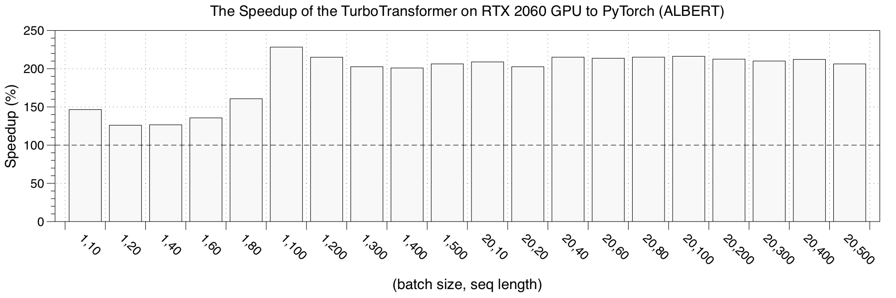
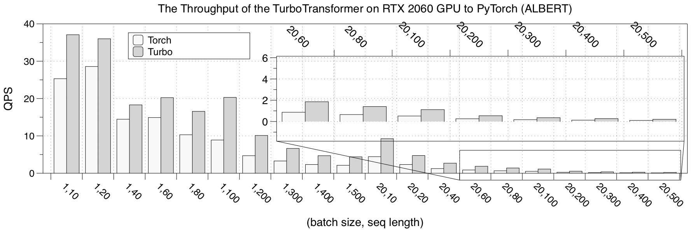

We show ALBERT inference performance here.

### GPU
We choose [PyTorch](https://github.com/huggingface "pytorch"), implementation as a comparison. The performance test result is the average of 150 iterations.

* RTX 2060

