We show BERT inference performance here.

### CPU
We tested the performance of TurboTransformers on three CPU hardware platforms.
We choose [pytorch](https://github.com/huggingface "pytorch"), [pytorch-jit](https://pytorch.org/docs/stable/_modules/torch/jit.html "pytorch-jit" ) and [onnxruntime-mkldnn](https://github.com/microsoft/onnxruntime "onnxruntime-mkldnn") and TensorRT implementation as a comparison. The performance test result is the average of 150 iterations. In order to avoid the phenomenon that the data of the last iteration is cached in the cache during multiple tests, each test uses random data and refreshes the cache data after calculation.
* Intel Xeon 61xx

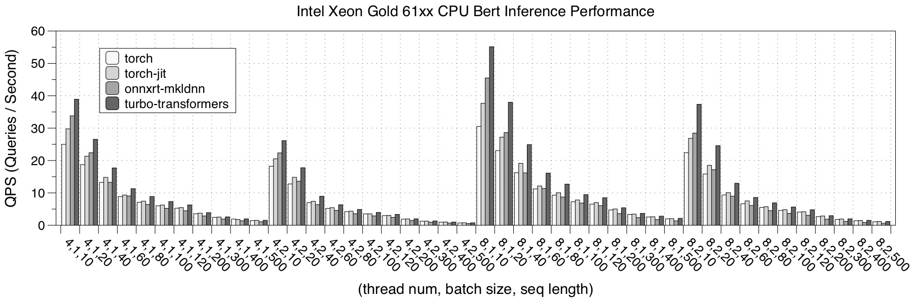
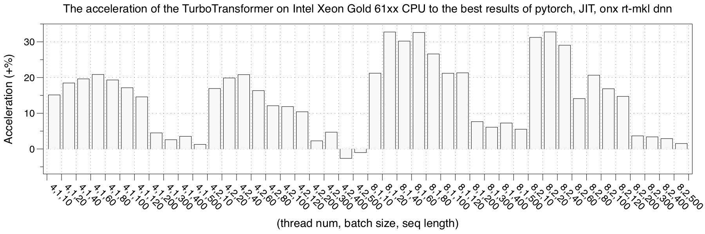

* Intel Xeon 6133
Compared to the 61xx model, Intel Xeon 6133 has a longer vectorized length of 512 bits, and it has a 30 MB shared L3 cache between cores.

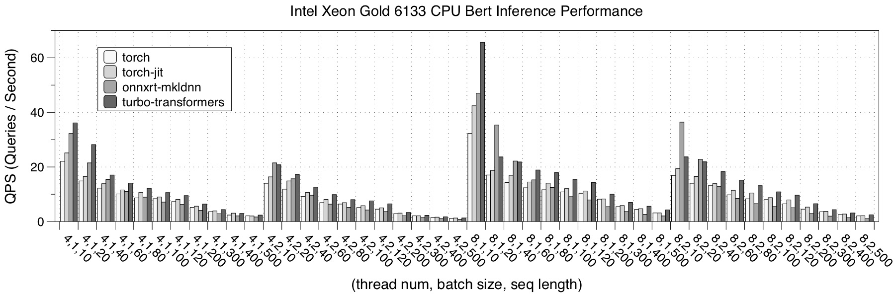
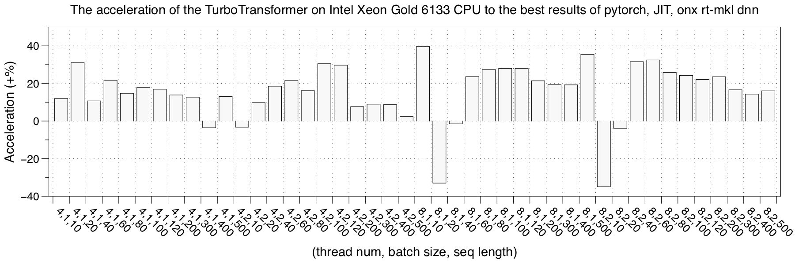

### GPU
We tested the performance of turbo_transformers on four GPU hardware platforms.
We choose [pytorch](https://github.com/huggingface "pytorch"), [NVIDIA Faster Transformers](https://github.com/NVIDIA/DeepLearningExamples/tree/master/FasterTransformer "FasterTransformer"), [onnxruntime-gpu](https://github.com/microsoft/onnxruntime "onnxrt-gpu") and [TensorRT](https://github.com/NVIDIA/TensorRT/tree/release/6.0/demo/BERT) implementation as a comparison. The performance test result is the average of 150 iterations.

* RTX 2060
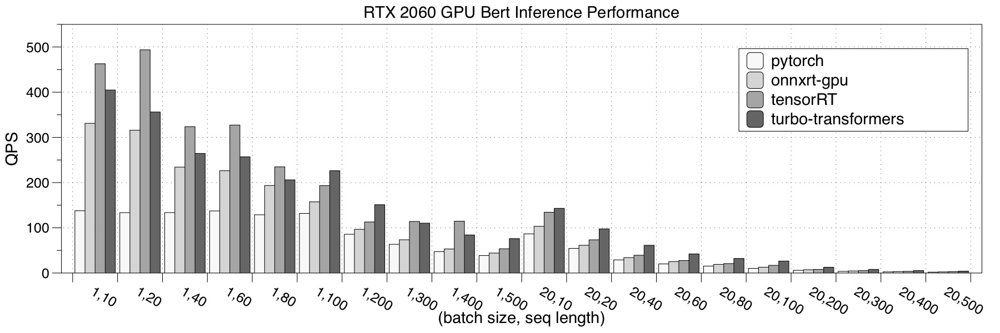
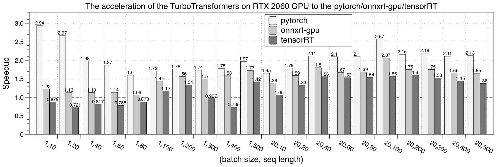

* Tesla V100

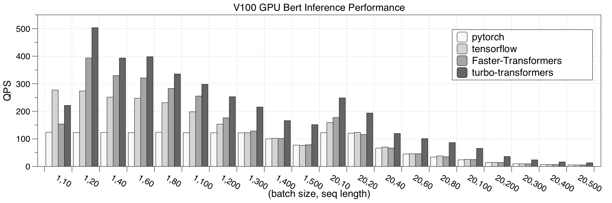
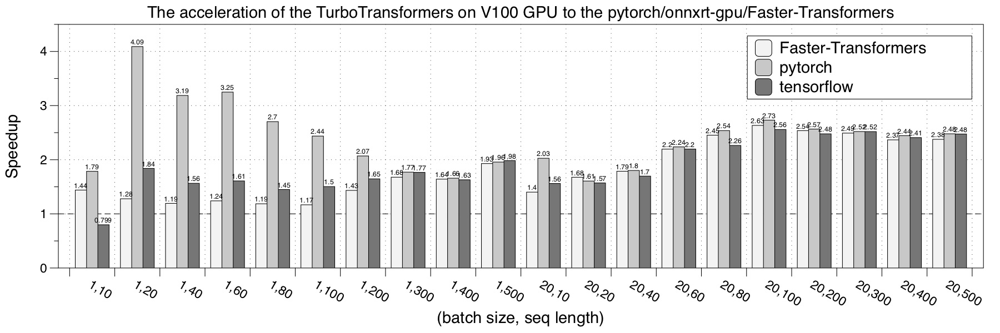

* Tesla P40

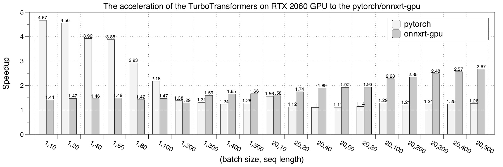

* Tesla M40

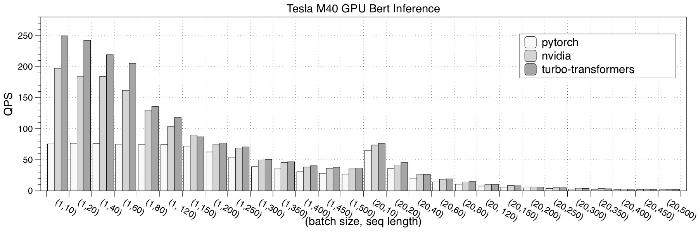
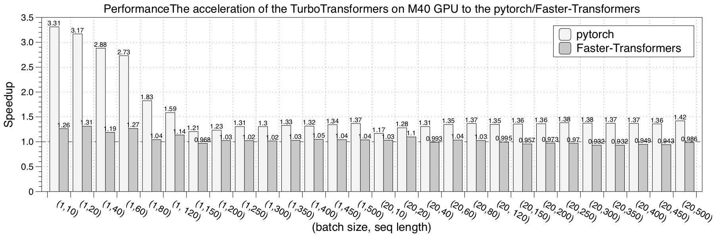
